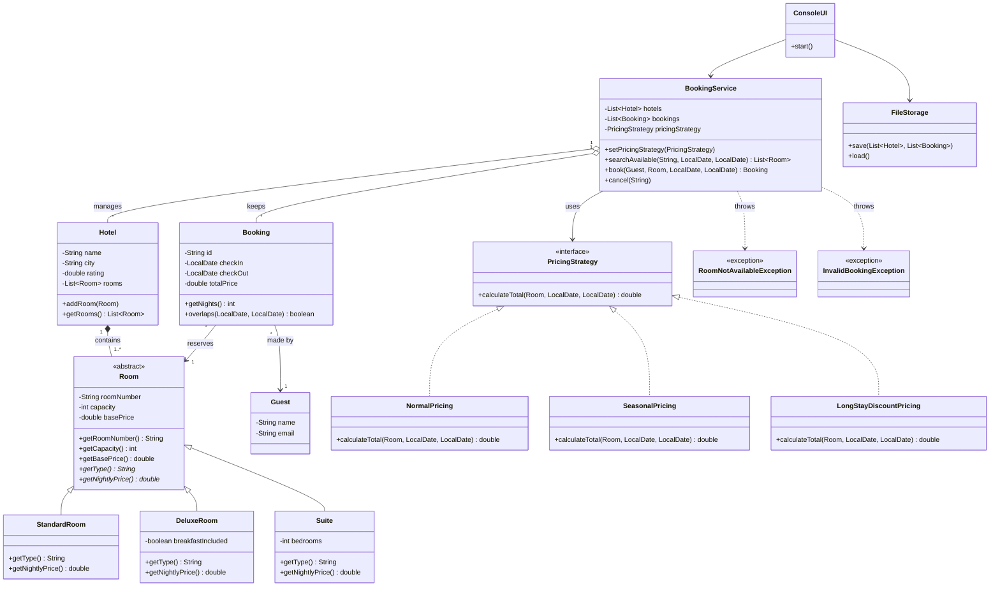

# UML Class Diagram

```mermaid
classDiagram
    class Room {
        <<abstract>>
        -String roomNumber
        -int capacity
        -double basePrice
        +getRoomNumber() String
        +getCapacity() int
        +getBasePrice() double
        +getType()* String
        +getNightlyPrice()* double
    }
    class StandardRoom {
        +getType() String
        +getNightlyPrice() double
    }
    class DeluxeRoom {
        -boolean breakfastIncluded
        +getType() String
        +getNightlyPrice() double
    }
    class Suite {
        -int bedrooms
        +getType() String
        +getNightlyPrice() double
    }
    class Hotel {
        -String name
        -String city
        -double rating
        -List~Room~ rooms
        +addRoom(Room)
        +getRooms() List~Room~
    }
    class Guest {
        -String name
        -String email
    }
    class Booking {
        -String id
        -LocalDate checkIn
        -LocalDate checkOut
        -double totalPrice
        +getNights() int
        +overlaps(LocalDate, LocalDate) boolean
    }
    class PricingStrategy {
        <<interface>>
        +calculateTotal(Room, LocalDate, LocalDate) double
    }
    class NormalPricing {
        +calculateTotal(Room, LocalDate, LocalDate) double
    }
    class SeasonalPricing {
        +calculateTotal(Room, LocalDate, LocalDate) double
    }
    class LongStayDiscountPricing {
        +calculateTotal(Room, LocalDate, LocalDate) double
    }
    class BookingService {
        -List~Hotel~ hotels
        -List~Booking~ bookings
        -PricingStrategy pricingStrategy
        +setPricingStrategy(PricingStrategy)
        +searchAvailable(String, LocalDate, LocalDate) List~Room~
        +book(Guest, Room, LocalDate, LocalDate) Booking
        +cancel(String)
    }
    class FileStorage {
        +save(List~Hotel~, List~Booking~)
        +load()
    }
    class ConsoleUI {
        +start()
    }
    class RoomNotAvailableException {
        <<exception>>
    }
    class InvalidBookingException {
        <<exception>>
    }

    Room <|-- StandardRoom
    Room <|-- DeluxeRoom
    Room <|-- Suite
    PricingStrategy <|.. NormalPricing
    PricingStrategy <|.. SeasonalPricing
    PricingStrategy <|.. LongStayDiscountPricing
    Hotel "1" *-- "1..*" Room : contains
    Booking "*" --> "1" Guest : made by
    Booking "*" --> "1" Room : reserves
    BookingService "1" o-- "*" Hotel : manages
    BookingService "1" o-- "*" Booking : keeps
    BookingService --> PricingStrategy : uses
    BookingService ..> RoomNotAvailableException : throws
    BookingService ..> InvalidBookingException : throws
    ConsoleUI --> BookingService
    ConsoleUI --> FileStorage
```