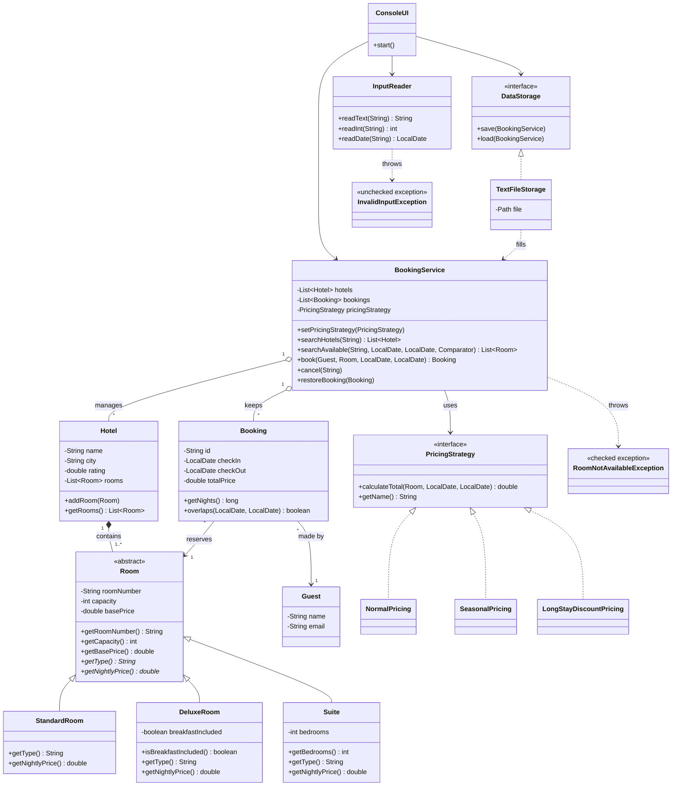

# UML Class Diagram

```mermaid
classDiagram
    class Room {
        <<abstract>>
        -String roomNumber
        -int capacity
        -double basePrice
        +getRoomNumber() String
        +getCapacity() int
        +getBasePrice() double
        +getType()* String
        +getNightlyPrice()* double
    }
    class StandardRoom {
        +getType() String
        +getNightlyPrice() double
    }
    class DeluxeRoom {
        -boolean breakfastIncluded
        +isBreakfastIncluded() boolean
        +getType() String
        +getNightlyPrice() double
    }
    class Suite {
        -int bedrooms
        +getBedrooms() int
        +getType() String
        +getNightlyPrice() double
    }
    class Hotel {
        -String name
        -String city
        -double rating
        -List~Room~ rooms
        +addRoom(Room)
        +getRooms() List~Room~
    }
    class Guest {
        -String name
        -String email
    }
    class Booking {
        -String id
        -LocalDate checkIn
        -LocalDate checkOut
        -double totalPrice
        +getNights() long
        +overlaps(LocalDate, LocalDate) boolean
    }
    class PricingStrategy {
        <<interface>>
        +calculateTotal(Room, LocalDate, LocalDate) double
        +getName() String
    }
    class NormalPricing
    class SeasonalPricing
    class LongStayDiscountPricing
    class BookingService {
        -List~Hotel~ hotels
        -List~Booking~ bookings
        -PricingStrategy pricingStrategy
        +setPricingStrategy(PricingStrategy)
        +searchHotels(String) List~Hotel~
        +searchAvailable(String, LocalDate, LocalDate, Comparator) List~Room~
        +book(Guest, Room, LocalDate, LocalDate) Booking
        +cancel(String)
        +restoreBooking(Booking)
    }
    class DataStorage {
        <<interface>>
        +save(BookingService)
        +load(BookingService)
    }
    class TextFileStorage {
        -Path file
    }
    class ConsoleUI {
        +start()
    }
    class InputReader {
        +readText(String) String
        +readInt(String) int
        +readDate(String) LocalDate
    }
    class RoomNotAvailableException {
<<checked exception>>
}
class InvalidInputException {
<<unchecked exception>>
}

Room <|-- StandardRoom
Room <|-- DeluxeRoom
Room <|-- Suite
PricingStrategy <|.. NormalPricing
PricingStrategy <|.. SeasonalPricing
PricingStrategy <|.. LongStayDiscountPricing
DataStorage <|.. TextFileStorage
Hotel "1" *-- "1..*" Room : contains
Booking "*" --> "1" Guest : made by
Booking "*" --> "1" Room : reserves
BookingService "1" o-- "*" Hotel : manages
BookingService "1" o-- "*" Booking : keeps
BookingService --> PricingStrategy : uses
BookingService ..> RoomNotAvailableException : throws
ConsoleUI --> BookingService
ConsoleUI --> DataStorage
ConsoleUI --> InputReader
InputReader ..> InvalidInputException : throws
TextFileStorage ..> BookingService : fills
```